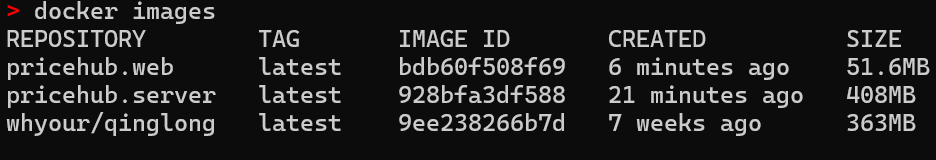

## Environment

- 开发环境：Ubuntu22.04 (wsl)
- 开发框架：Vue + Java

- 前端启动：`npm run dev`
- 后端启动：`mvn spring-boot:run`

## Docker

### Server

```bash
mvn clean package
docker build -t pricehub.server:latest .
```

### Web

```bash
npm run build:prod
docker build -t pricehub.web:latest .
```



```bash
docker run -d -p 8000:80 --name pricehub.web pricehub.web:latest
```

